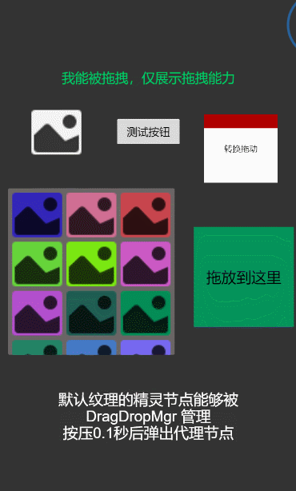

# CocosCreator 3.7.x 游戏开发框架
- [CocosCreator 3.7.x 游戏开发框架](#cocoscreator-37x-游戏开发框架)
    - [介绍](#介绍)
    - [基类](#基类)
      - [`GComponent`](#gcomponent)
      - [`UIBase`](#uibase)
    - [资源管理](#资源管理)
      - [`AssetLoader`](#assetloader)
      - [`LoaderMgr`](#loadermgr)
      - [`ResourcesMgr`](#resourcesmgr)
    - [场景管理](#场景管理)
    - [UI 管理](#ui-管理)
    - [输入](#输入)
      - [类 `KeyboardMgr`](#类-keyboardmgr)
      - [类 `MouseMgr`](#类-mousemgr)
      - [类 `TouchMgr`](#类-touchmgr)
    - [事件管理](#事件管理)
    - [全局定时器](#全局定时器)
    - [池管理](#池管理)
    - [拖放管理](#拖放管理)
    - [截图管理](#截图管理)
    - [按钮通用事件管理](#按钮通用事件管理)
    - [红点管理](#红点管理)
    - [网络管理](#网络管理)
    - [多语言](#多语言)
    - [TiledMap](#tiledmap)
    - [MVVM](#mvvm)
    - [装饰器](#装饰器)
    - [寻路](#寻路)
    - [相机控制](#相机控制)
      - [相机跟随](#相机跟随)
      - [相机缩放/双指缩放](#相机缩放双指缩放)
      - [屏幕震动](#屏幕震动)
    - [热更新](#热更新)
    - [活动管理](#活动管理)
    - [工具类](#工具类)
    - [引擎扩展](#引擎扩展)
    - [周边工具](#周边工具)
      - [excel导表](#excel导表)
      - [帧动画打包](#帧动画打包)
      - [热更新](#热更新-1)
      - [protobuf](#protobuf)
      - [psd转预制体](#psd转预制体)
      - [中文文件名转拼音](#中文文件名转拼音)
      - [图片压缩](#图片压缩)
    - [框架插件](#框架插件)
    - [参考](#参考)
      - [AssetLoader](#assetloader-1)
      - [MVVM](#mvvm-1)
      - [其他](#其他)

### 介绍

使用本框架在开发过程中是远离编辑器，不在编辑器中挂载脚本到节点，但是在运行时会自动挂载脚本到节点。
框架所有管理者单例和大部分类都挂载到了全局变量 `tnt` 上，文档中为了书写方便，省略了 `tnt.`
游戏启动需要有一个启动类和启动场景，将启动类挂载到启动场景中，在后续使用过程中，基本不再需要手动在节点挂载组件了。

>为保证在编辑器内优先加载框架代码，这里使用了 `a-framework` 作为文件夹名，`a-framework` 作为Bundle 名为 `framework`，在开发过程中其他 Bundle 尽量保证要在框架 Bundle 后加载

框架启动需要实现 `IStartupOptions`  
详细的使用可以启动实例 Launcher.scene 查看，脚本同名。

```
// 启动框架 
tnt.startup(startupOptions);

```


### 基类
#### `GComponent` 
继承自 `Component`  

属性
prefabUrl，bundle：需要子类搭配 【类装饰器】 @prefabUrl("xxx/xxx","bundle") 使用。  
loaderKey： 属性为 资源管理器的键值，用以保证在资源能够正确的加载和释放，尽量不要手动去设置这个值  
为保持接口风格统一，使用 onStart 代理 start ， 也可以直接使用 start ，不影响。


####  `UIBase` 
继承自 `GComponent`

实现了大部分 `ComponentUtils` 中的功能

`UIBase` 的子类

- `UIItem` 小部件项
- `UIPanel` 面板项
- `UIWindowBase` 弹窗基类，
  - `UIPopup` 模态窗口 会自动生成半透明蒙版
  - `UIWindow` 全屏窗口 需要手动设置背景图，

1. UI 基类
每一个作为预制体的小部件、面板、弹窗都需要对应一个脚本  
当前类所在的节点添加预制体时，提供了以下几个方法

- `addPanel`    预添加可切换的面板，没有真正创建实例，使用示例可参考 `EmbedWindow` 
- `showPanel`   显示预制体面板，如果有实例则直接显示，没有实例则创建后显示，使用示例可参考 `EmbedWindow` 
- `addUI`       添加预制体节点，直接加载并创建实例，有参数提示，使用示例可参考 `EmbedWindow` 
- `loadUI`      加载预制体节点，只加载不进行创建实例


2. 弹窗  
   在弹出关闭时，默认会自动释放弹窗的预制体资源，如果需要关闭可以调用 `setReleaseWindowPrefab` 进行设置  

   使用示例 PauseWindow.ts
```

const { prefabUrl } = tnt._decorator;

// 外部需要传入的参数
// 参数接口命名规则：弹窗名+Options，如 弹窗名为 `PauseWindow` 则接口命名为 `PauseWindowOptions`
// 注意需要使用 declare global {} ，否则智能提示不生效

declare global { 
  interface PauseWindowOptions{
    pauseBgm: boolean;
  }
}

//@prefabUrl("window-example#prefabs/PauseWindow")// 预制体路径  写法1 
@prefabUrl("prefabs/window/PauseWindow","window-example") // 预制体路径，写法2 两种写法都可以
@ccclass('PauseWindow')
export class PauseWindow extends tnt.UIPopup<PauseWindowOptions> {
    
    onActive(): void {
      // 窗口激活, 首次打开和从冻结状态激活都会被调用
      if(this.options.pauseBgm){
        // ...
      }
    }
    onFreeze(): void {
      // 窗口冻结，窗口被关闭时不会被自动调用
    }

    onShowCallback() {
      // 界面完整显示的回调
    }
    onCloseCallback() {
      // 界面完全关闭的回调
    }
    
    _playShowAnimation(tag: number, callback: () => void) {
      // 定制显示动效
      callback();
    }
    _playCloseAnimation(tag: number, callback: () => void) {
      // 定制关闭动效
      callback();
    }
    // ... 其他方法请直接查看 UIWindowBase 源码 
}

```


### 资源管理
#### `AssetLoader`
`AssetLoader` 资源的加载释放管理，每个模块或者每个界面都可以实例化一个加载器，在退出模块或者关闭界面的时候一次性释放所依赖的资源，而不影响其他模块或界面的相同依赖资源。  
`AssetLoader` 的使用基本与 引擎 Bundle 加载资源的方法一致。
> 在本框架中，每个弹窗都持有了一个 加载器 `this.loader`，为当前弹窗加载资源时直接使用弹窗内置的 加载器。

#### `LoaderMgr`
`LoaderMgr` 加载器管理类，通过任意键值获取或实例化一个加载器  
> 全局共享的 `AssetLoader` 为 `tnt.loaderMgr.share`

#### `ResourcesMgr`
`ResourcesMgr` 加载器的顶级封装，相当于 `LoaderMgr` + `AssetLoader` 的结合，只是为了方便使用


### 场景管理
每个场景要对应一个同名脚本，用框架插件生成 Scene 声明文件后，调用时会有代码提示


### UI 管理

类 `UIMgr` 

1. 基础使用
使用框架插件 生成 UI 声明文件 后，调用时会有代码提示和参数类型检查


```
   tnt.uiMgr.showWindow('PauseWindow', { pauseBgm: true }, (pauseWindow) => {

        //增加弹窗关闭监听处理
        pauseWindow.addCloseListener(() => {
            // 这里会在  PauseWindow  关闭之后显示 "DialogWindow"
            tnt.uiMgr.addToQueue('DialogWindow', () => {

            });
            //在队列后追加弹窗
            tnt.uiMgr.addToQueue('VictoryWindow', { 'awards': [] });
            // 开始显示
            tnt.uiMgr.showQueue(() => {
                console.log(`弹窗队列完成`);
            });
        });
    })
```


2. 弹窗队列
  ```
  
  //在队列后追加弹窗
  tnt.uiMgr.addToQueue('PauseWindow', { 'pauseBgm': true }, () => {
      // 插入到队列最前面，这里会在  PauseWindow  关闭之后显示 "DialogWindow"
      tnt.uiMgr.insertToQueue('DialogWindow', () => {

      });
  });
    //在队列后追加弹窗
  tnt.uiMgr.addToQueue('VictoryWindow', { 'awards': [] });

  // 开始显示
  tnt.uiMgr.showQueue(() => {
      console.log(`弹窗队列完成`);
  });
  ```
  **注意**：正常显示的弹窗与队列弹窗的方法无法交叉使用

3. 通用背景设置

具体可以查看 `WindowScene` 
```
tnt.uiMgr.setMaskLayerController(CaptureScreenMaskLayerController.getInstance());
```

4. 场景切换还原界面
5. 调试输出到界面
```
tnt.uiMgr.showDebugToast("...");
```
6. 全屏屏蔽输入
 ```
 tnt.uiMgr.showBlockInput();
 tnt.uiMgr.closeBlockInput(); 
 ```
7. 插件,可参考 `TopMenuBarPlugin` 和 `UIDebugToastPlugin` 的使用


---
> 以上  showWindow 使用字符串的方式是为了减少脚本的相互引用，以便跨 Bundle 调用弹窗  
> 如果你可以保证正确的引用依赖，可以使用 showWindowByClass 
---
### 输入
#### 类 `KeyboardMgr`  
```
// 添加监听和取消监听尽量保证成对出现，被监听的对象需要实现 IKey 接口
tnt.keyboard.on(keyboardImpl); // 监听 
tnt.keyboard.off(keyboardImpl); // 取消监听 


// 组合键 控制键为 [KeyCode.CTRL_LEFT, KeyCode.SHIFT_LEFT, KeyCode.ALT_LEFT]
tnt.keyboard.enableCombination = true;

具体使用方式参考 `KeyBoardListener`
```


#### 类 `MouseMgr`  
```
// 添加监听和取消监听尽量保证成对出现，被监听的对象需要实现 IMouse 接口
tnt.mouse.on(mouseImpl); // 监听
tnt.mouse.off(mouseImpl); // 取消监听

```

#### 类 `TouchMgr`  
```
// 添加监听和取消监听尽量保证成对出现，被监听的对象需要实现 ITouch 接口
tnt.touch.on(touchImpl); // 监听
tnt.touch.off(touchImpl);  // 取消监听

```


### 事件管理
类 `EventMgr`  
使用方式与引擎的事件管理基本一致，尽量保证 `on、off ` 成对出现，或者直接使用 `targetOff`
```
  tnt.eventMgr.on("key1",()=>{},this);
  tnt.eventMgr.on("key2",()=>{},this);
  tnt.eventMgr.on("key3",()=>{},this);

  
  tnt.eventMgr.targetOff(this);
```

### 全局定时器
类 `TimerMgr`  
对 `scheduler` 的封装，开启定时器时会返回一个唯一 id 标识，可以用作移除定时器
```
  // 开启计时器
  let timerId = tnt.timerMgr.startTimer(()=>{  },this);
  // 移除计时器
  tnt.timerMgr.removeTimer(timerId);

  // 或者在离开界面的时候将此界面绑定的所有计时器关闭
  tnt.timerMgr.removeTimerByTarget(this);
```


### 池管理
类 `PoolMgr`
对 Pool 进行统一管理，方便任意地方去使用

### 拖放管理
类 `DragDropMgr`  
方便快捷的实现拖放
具体使用请查看脚本 `DragDropScene`，场景同名  
效果如下




### 截图管理
类 `CaptureMgr`
业务层一行代码实现全屏截图或指定节点截图
具体使用请查看脚本 `CaptureScene`，场景同名

### 按钮通用事件管理
类 `BtnCommonEventMgr` 
内置按钮音效插件


### 红点管理
### 网络管理
类 `NetMgr`

### 多语言
`i18n`  
每种语言使用一个 Bundle，命名规则为 `language-${语言}`

目录结构如下

```
|-- language-en 
|-- language-zh 
    |-- font
        |-- normal.ttf
    |-- image
        |-- logo.png
        |-- title.png
    |-- text
        |--zh.json  
```
### TiledMap
类 `TiledMapProxy`  

### MVVM

### 装饰器
`./assets/framework/decorators/_decorator.ts`

### 寻路


### 相机控制
#### 相机跟随
#### 相机缩放/双指缩放
#### 屏幕震动
 

### 热更新

### 活动管理


### 工具类
  `ComponentUtils`
  1. `findNode` 查找节点
  2. `resetNodeCache` 重置缓存
  3. `findComponent` 查找组件
  4. `registerButtonClick` 注册按钮事件
  5. `registerNodeTouchEvent` 注册节点触摸事件
  6. `registerNodeLongTouchEvent` 注册节点长按事件
  7. `registeEditBoxDidEnd` 注册 EditBox 完成事件
  8. `registerToggleClick` 注册 Toggle 点击事件
  9. `registerToggleGroupEvent` 注册 ToggleGroup 事件，经常与 `toggleCheck` 搭配使用
  10. `toggleCheck` 将 ToggleGroup 中的指定 Toggle 设置为选中
  11. `registerSliderEvent` 注册滑块事件
  

### 引擎扩展

1. Node 添加属性 draggable, 可直接设置为拖拽节点
2. Button 添加方法 setSoundName ，设置点击音效
3. ~~visible 轻量级的 active~~
4. 快速访问组件
5. vec2 增加方法 copyAsVec3
6. vec3 增加方法 copyAsVec2


### 周边工具
#### excel导表
生成 json 文件及  dts
#### 帧动画打包
将帧动画打包成合图并生成对应 json 数据

#### 热更新

#### protobuf
生成 MsgID、ErrorCode

#### psd转预制体
将 psd 转为可以直接在 cocos 中使用的预制体，前提是需要在 Photoshop 中根据文档做好图层的处理

#### 中文文件名转拼音
批量修改文件名为拼音，同音字会在文件名后加 自增id

#### 图片压缩
用 tiny 压缩图片资源


### 框架插件
- 生成 UI 声明文件
- 生成 Scene 声明文件

### 参考  
#### AssetLoader  
https://blog.csdn.net/xzben/article/details/120039818

#### MVVM  
https://forum.cocos.org/t/topic/78821  
https://github.com/wsssheep/cocos_creator_mvvm_tools

#### 其他  
https://github.com/1226085293/nodes/blob/master/assets/essential/engine/node/nodes.js 
https://github.com/fairygui/FairyGUI-cocoscreator/blob/master/source/src/fairygui/GObject.ts
https://github.com/fairygui/FairyGUI-cocoscreator/blob/master/source/src/fairygui/DragDropManager.ts
